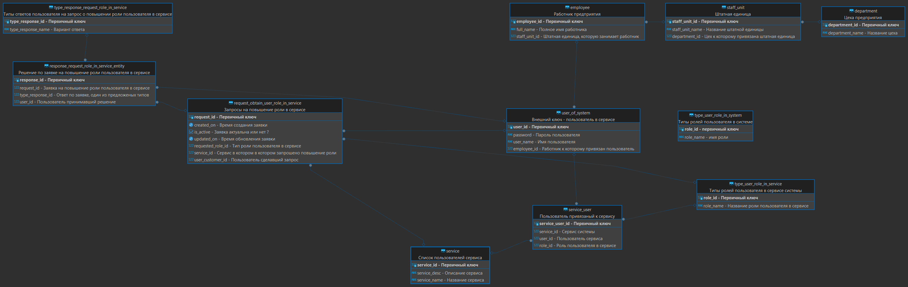

# Тестовое задание для СИТ ЮУ АЭС.

Web application для управления доступом к сервисам системы.
Пользователь admin-sys добавляет работников и пользователей 
(из числа работников) в систему, создаёт сервисы и назначает 
им владельца и админа, добавляет цеха и штатные единицы.

Когда пользователь системы запрашивает доступ к сервису, 
владелец сервиса может дать доступ после этого админ сервиса
принимает окончательное решение
`(User requests access -> Owner -> Admin).`


## Схема базы данных



## Подготовка:

Для сборки образа OracleDB для docker:
```shell
git clone https://github.com/oracle/docker-images.git
cd docker-images/OracleDatabase/SingleInstance/dockerfiles
./buildContainerImage.sh -v 21.3.0 -t oracle-db-xe:21.3.0 -x
```

После сборки образа создаём и поднимаем контейнер через docker-compose.
```shell
cd dev_utils/db
docker-compose up
```

Код для создания пользователя в OracleDB: 
```sql
CREATE USER c##its IDENTIFIED BY password;
GRANT CREATE TABLE TO c##its;
GRANT RESOURCE TO c##its;
GRANT CONNECT TO c##its;
GRANT CREATE VIEW TO c##its;
GRANT CREATE SESSION TO c##its;
GRANT UNLIMITED TABLESPACE TO c##its;
```

## Запуск
В режиме develop:
```java -jar -Dspring.profiles.active=dev demo-app.jar```

В режиме production для телефона:
```java -jar -Dspring.profiles.active=prod-phone demo-app.jar```


## RestAPI
| HTTP Method | url                                                                           | desc                                                 |
|-------------|-------------------------------------------------------------------------------|------------------------------------------------------|
| GET         | /api/v1/departments                                                           | Get all                                              |
| POST        | /api/v1/departments                                                           | Create                                               |
| PUT         | /api/v1/departments/{id}                                                      | Update                                               |
| DELETE      | /api/v1/departments/{id}                                                      | Delete                                               |
|             |                                                                               |                                                      |
| GET         | /api/v1/staff-units                                                           | Get all                                              |
| POST        | /api/v1/staff-units                                                           | Create                                               |
| PUT         | /api/v1/staff-units/{id}                                                      | Update                                               |
| DELETE      | /api/v1/staff-units/{id}                                                      | Delete                                               |
|             |                                                                               |                                                      |
| GET         | /api/v1/employees                                                             | Get all                                              |
| POST        | /api/v1/employees                                                             | Create                                               |
| PUT         | /api/v1/employees/{id}                                                        | Update                                               |
| DELETE      | /api/v1/employees/{id}                                                        | Delete                                               |
|             |                                                                               |                                                      |
| GET         | /api/v1/users                                                                 | Get all                                              |
| POST        | /api/v1/users                                                                 | Create                                               |
| PUT         | /api/v1/users/{id}                                                            | Update                                               |
| DELETE      | /api/v1/users/{id}                                                            | Delete                                               |
|             |                                                                               |                                                      |
| GET         | /api/v1/viewer/{user_id}                                                      | Get list of services for usage by users              |
| GET         | /api/v1/{service_id}/users/{user_id}                                          | Get service item                                     |
| GET         | /api/v1/users/types/roles                                                     | Get possible user role types in services             |
| GET         | /api/v1/users/{userId}/role/{roleId}                                          | Get services where user (user_id) has role (role_id) |
| POST        | /api/v1/{serviceId}/request/obtain/users/{userId}/role/{userRoleId}           | A request to obtain the user role in the service     |
| GET         | /api/v1/users/{userId}/access/response/waiting                                | Loading services which waiting approved to access    |
| POST        | /api/v1/{serviceId}/request/obtain/role/users/from/{fromUserId}/to/{toUserId} | Client send response access grant to service         |
| GET         | /api/v1/{serviceId}/history                                                   | Load history of requests user role in service        |
|             |                                                                               |                                                      |
| POST        | /api/v1/admin-sys/fill-mock-data                                              | Send command to fill tables by mock data             |
| POST        | /api/v1/admin-sys/truncate-db                                                 | Send command to truncate database                    |
